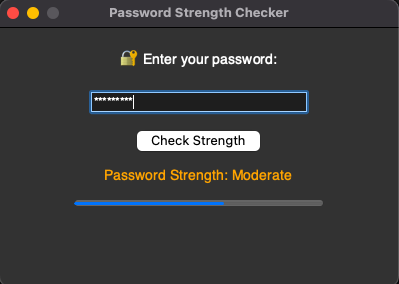

# Password Strength Checker 🔐

A simple and interactive password strength checker built with **Python** and **Tkinter**.  
This tool helps users create strong and secure passwords by evaluating strength based on various rules.

---

## 🚀 Features

- 🔍 Real-time password strength meter
- 🧠 Criteria checks:
  - Minimum length
  - Contains uppercase, lowercase, number, and symbol
  - Avoids common patterns
- 🖥️ Visual feedback with color indicators and progress bar

---

## 🖼️ App Screenshot



---

## 🛠️ How to Run

1. Clone this repository:
   ```bash
   git clone https://github.com/stndiablo/PasswordStrengthApp.git
   cd PasswordStrengthApp

## Run the App

python3 password_checker.py
